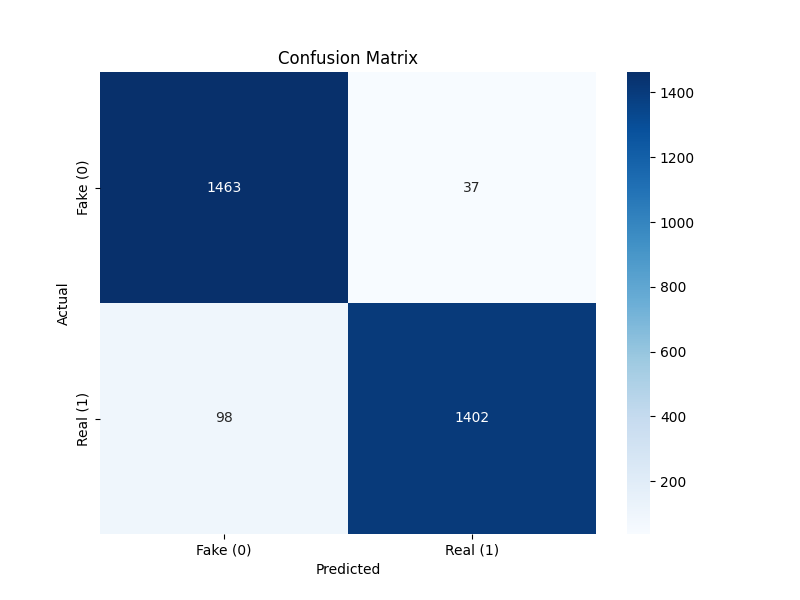

# 🛡️ Deepfake 影像偵測系統 (RVF10k 實作)

這是一個基於深度學習的 Deepfake 影像偵測系統，使用 **ResNet18** 進行遷移學習 (Transfer Learning)，並在 **RVF10k** 資料集上達成 **96%** 的辨識準確率。

## 🚀 專案特點
* **高效辨識**：針對 AI 生成人臉進行特徵提取與真偽判定。
* **即時介面**：整合 Streamlit 建立網頁應用，支援拖拽上傳圖片並立即分析。
* **專業評估**：包含完整的訓練日誌、Confusion Matrix 與 Classification Report。

## 📊 模型效能 (Validation Set)
在 3000 張測試照片中：
* **準確率 (Accuracy)**: 96.2%
* **F1-Score**: 0.96
* **處理速度**: 每張圖片推論時間 < 0.1s (使用 CUDA)



## 🛠️ 安裝與使用

### 1. 環境配置
建議使用 Python 3.10+。
```bash
pip install -r requirements.txt
```

### 2. 執行網頁程式
```bash
streamlit run app.py
```

## 📂 檔案結構
* **app.py**: Streamlit 網頁主程式。

* **train.py**: 模型訓練與評估腳本。

* **rvf10k_model.pth**: 訓練完成的模型權重檔。

* **requirements.txt**: 必要 Python 套件清單。